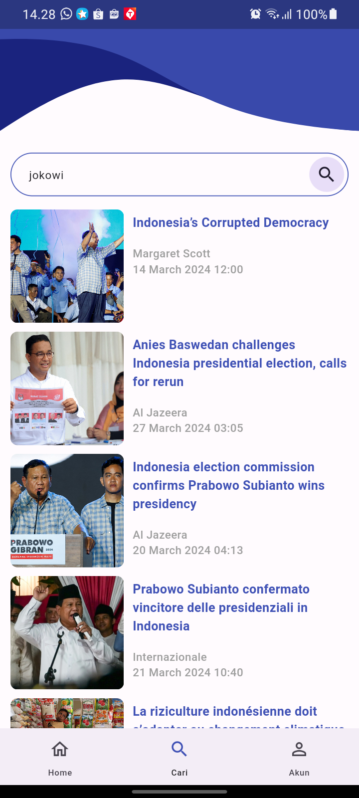

# News App

## Screenshots

&nbsp;&nbsp;
&nbsp;&nbsp;
&nbsp;&nbsp;
&nbsp;&nbsp;
&nbsp;&nbsp;

### How To Run This Project
1. Extract Project
2. flutter pub get in terminal
3. Connect to Firebase with Firebase CLI [See Documentation](https://firebase.google.com/docs/cli?hl=id)
4. Add apiKey in news_app/core/api/urls.dart

### How To Install Apk
1. Extract Project
2. Open news_app/apk-release/apk-release.apk
3. Copy to your Smartphone
4. Install the App on your Smartphone